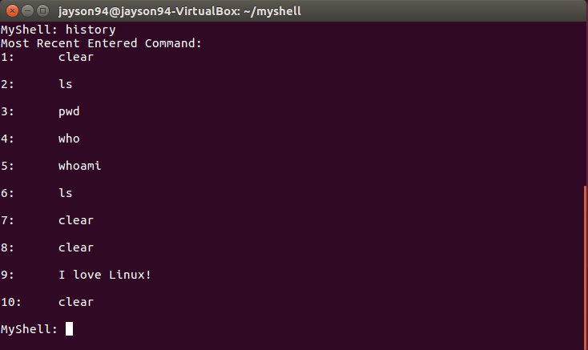

# Simple Shell
## Introduction
- A simple shell interface using the C Programming Language that accept user commands, creates a child process, and executes the user command in the child process.
- It provides users a prompt after which the next command is entered. 
- Additional Features: **Show History**
  - Show History will allow users to assess up to 10 most recently entered command.

